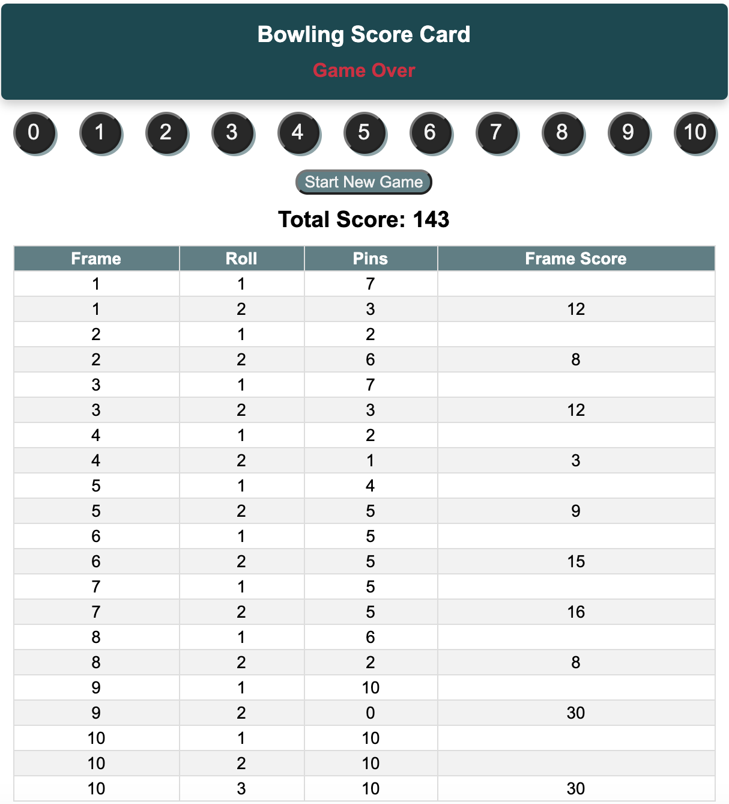

# Bowling Score Calculator

A bowling score calculator application written in Javascript. 
This score calculator allows for a swift and dynamic calculation of score for each of the frames of a bowling game. 

### How does it work ? 

* The game consists of ten frames. Frame 1-9 are composed of two rolls. Frame 10 can be composed of up to three rolls 
depending on if the first rolls in the frame is a strike or a spare. 
* Each frame can have one of three marks: 
  * Strike: all 10 pins where knocked down with the first roll.
  * Spare: all 10 pins where knocked down using two rolls.
  * Open: some pins where left standing after the frame was complete.
* When calculating the total score, the sum of the score for each frame is use.
  * For an open frame the score is the total number of pins knocked down.
  * For a strike, the score is 10 + the sum of the two rolls in the following frame.
  * For a spare, the score is 10 + the number of pins knocked down in the first roll of the following frame. 
  
The tenth frame may composed of up to three rolls: the bonus roll(s) following a strike or spare in the tenth (sometimes referred to as the eleventh and twelfth frames) are fill ball(s) used only to calculate the score of the mark rolled in the tenth.

## Dependencies
 * Angular 9
 * NGRX
 * Nodejs
 
 **Note**: Unit test of the components are perform using default Jasmine test framework provided by Angular CLI.
 
## Project Structure

### Components
    
  **BowlingPageComponent** : This is the container for child components. It is responsible for changing state of the game and delegating inputs to the child components. 
  
  **PinComponent** : This component allows users to input number of pin knocked down. The inputs from users are send to BowlingPageComponent using event emitters.
 
  **ScoreBoardComponent**: This component receives inputs from BowlingPageComponent to display total score and, the score of each frame. It uses **FrameFormat** custom pipe to format the scores for showing in html table. 
  
  **Calculator**: It is a utility class for calculating the scores of the frames.
  
  
## Compile, Run & Test
   ```
    ng serve
    ng test 
   ```  

### Example Score Board   
 
 
### Example Test

   ```
         it('#isSpare should be true when all 10 pins where knocked down using two rolls', () => {
            const roll: Roll = {first: 6, second: 4};
            expect(calculator.isSpare(roll)).toBeTrue();
          });
        
          it('#isOpen should be true when some pins where left standing after the frame was completed', () => {
            const roll: Roll = {first: 2, second: 1};
            expect(calculator.isOpen(roll)).toBeTrue();
          });
        
          it('for an open frame, #calculate should return total score as sum number of pins knocked down in current frame', () => {
            const roll: Roll[] = [{first: 1, second: 4}, {first: 2, second: 2}];
            expect(calculator.calculate(roll)).toEqual({totalScore: 9, frameScores: [5, 4]});
          });
   ```  
